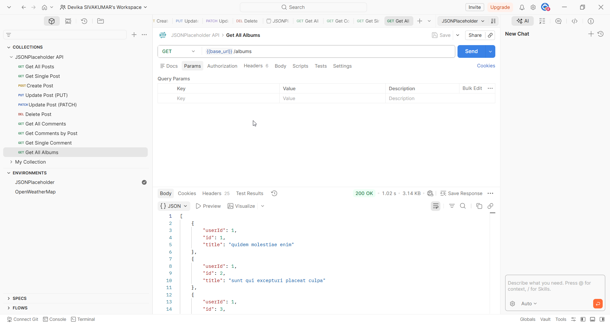
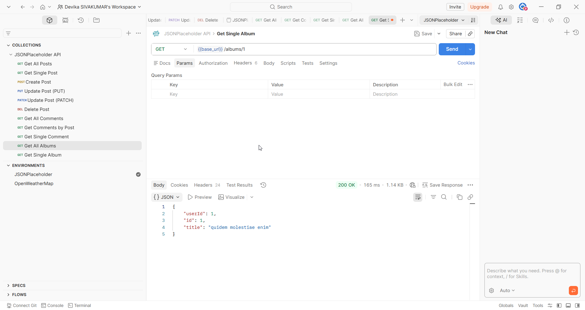
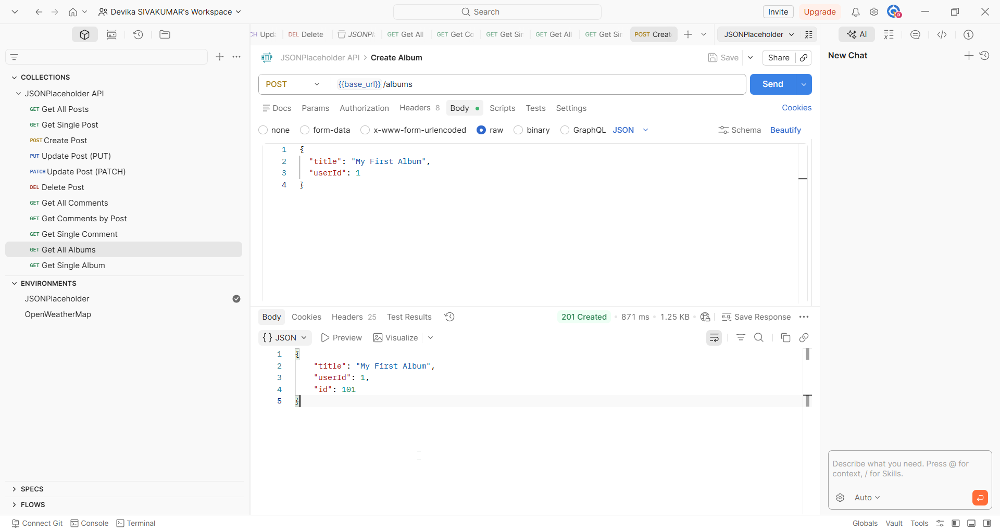

# Albums

## Overview

The Albums endpoint allows you to retrieve and create albums. Each album belongs to a user and contains a title.

## Base URL

```
https://jsonplaceholder.typicode.com
```

## Authentication

No authentication required. JSONPlaceholder is a free public API.

## Table of Contents

- [Get All Albums](#get-all-albums)
- [Get Single Album](#get-single-album)
- [Create Album](#create-album)
- [Error Responses](#error-responses)

---

## Endpoints

| Method | Endpoint | Description |
|--------|----------|-------------|
| GET | /albums | Retrieve all albums |
| GET | /albums/{id} | Retrieve a single album |
| POST | /albums | Create a new album |

---

## Get All Albums

### Request

```
GET /albums
```

### Sample Request

```bash
curl https://jsonplaceholder.typicode.com/albums
```

### Sample Response

```json
[
  {
    "userId": 1,
    "id": 1,
    "title": "quidem molestiae enim"
  }
]
```



### Response Fields

| Field | Type | Description |
|-------|------|-------------|
| userId | number | ID of the user who owns the album |
| id | number | Unique identifier of the album |
| title | string | Title of the album |

---

## Get Single Album

### Request

```
GET /albums/{id}
```

### Path Parameters

| Parameter | Type | Required | Description |
|-----------|------|----------|-------------|
| id | number | Yes | The unique identifier of the album |

### Sample Request

```bash
curl https://jsonplaceholder.typicode.com/albums/1
```

### Sample Response

```json
{
  "userId": 1,
  "id": 1,
  "title": "quidem molestiae enim"
}
```



---

## Create Album

### Request

```
POST /albums
```

### Request Body

| Field | Type | Required | Description |
|-------|------|----------|-------------|
| title | string | Yes | Title of the album |
| userId | number | Yes | ID of the user creating the album |

### Sample Request

```bash
curl -X POST https://jsonplaceholder.typicode.com/albums \
  -H "Content-Type: application/json" \
  -d '{
    "title": "My First Album",
    "userId": 1
  }'
```

### Sample Response

```json
{
  "title": "My First Album",
  "userId": 1,
  "id": 101
}
```



> **Note:** Returns the created album with a server-generated ID. Status code 201 Created.

### Response Fields

| Field | Type | Description |
|-------|------|-------------|
| title | string | Title of the created album |
| userId | number | ID of the user who created the album |
| id | number | Server-generated unique identifier for the new album |

---

## Error Responses

| Code | Description |
|------|-------------|
| 404 | Album not found — the specified ID does not exist |
| 400 | Bad request — the request body is missing or malformed |