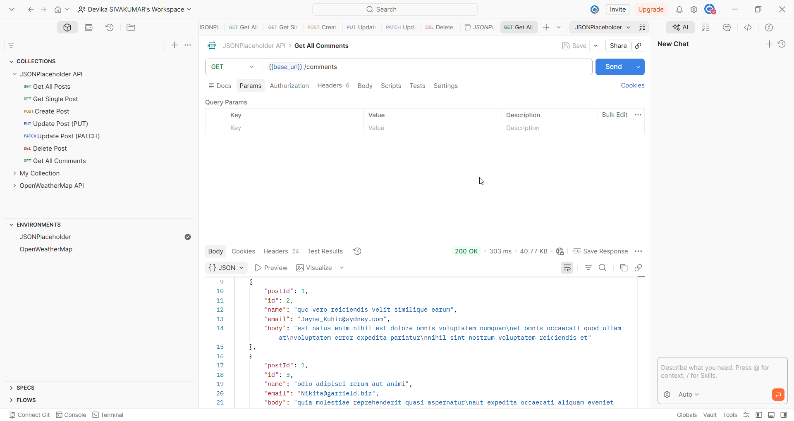
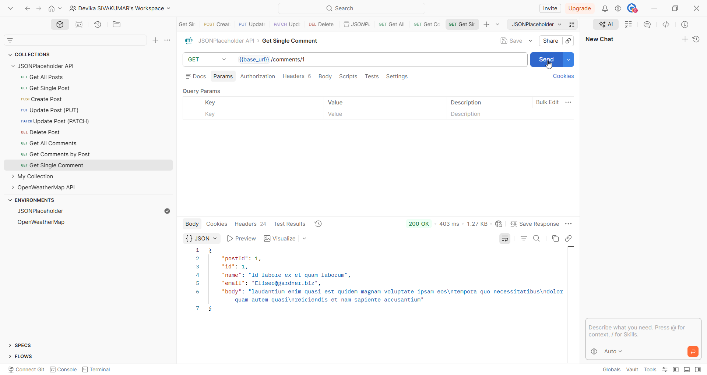
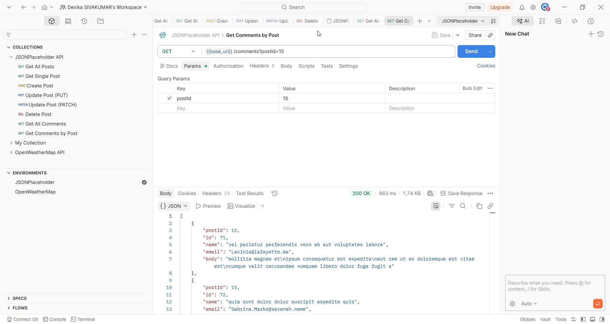

# Comments

## Overview

The Comments endpoint allows you to retrieve comments. Each comment belongs to a post and contains a name, email, and body. Comments can be filtered by post ID.

## Base URL

```
https://jsonplaceholder.typicode.com
```

## Authentication

No authentication required. JSONPlaceholder is a free public API.

## Table of Contents

- [Get All Comments](#get-all-comments)
- [Get Single Comment](#get-single-comment)
- [Get Comments by Post](#get-comments-by-post)
- [Error Responses](#error-responses)

---

## Endpoints

| Method | Endpoint | Description |
|--------|----------|-------------|
| GET | /comments | Retrieve all comments |
| GET | /comments/{id} | Retrieve a single comment |
| GET | /comments?postId={id} | Retrieve all comments for a specific post |

---

## Get All Comments

### Request

```
GET /comments
```

### Sample Request

```bash
curl https://jsonplaceholder.typicode.com/comments
```

### Sample Response

```json
[
  {
    "postId": 1,
    "id": 1,
    "name": "id labore ex et quam laborum",
    "email": "Eliseo@gardner.biz",
    "body": "laudantium enim quasi est quidem magnam voluptate ipsam eos"
  }
]
```

> **Note:** Returns an array of 500 comments. Only one item is shown here for brevity.

### Response Fields

| Field | Type | Description |
|-------|------|-------------|
| postId | number | ID of the post this comment belongs to |
| id | number | Unique identifier of the comment |
| name | string | Name or title of the comment |
| email | string | Email address of the commenter |
| body | string | Main content of the comment |


---

## Get Single Comment

### Request

```
GET /comments/{id}
```

### Path Parameters

| Parameter | Type | Required | Description |
|-----------|------|----------|-------------|
| id | number | Yes | The unique identifier of the comment |

### Sample Request

```bash
curl https://jsonplaceholder.typicode.com/comments/1
```

### Sample Response

```json
{
  "postId": 1,
  "id": 1,
  "name": "id labore ex et quam laborum",
  "email": "Eliseo@gardner.biz",
  "body": "laudantium enim quasi est quidem magnam voluptate ipsam eos"
}
```

---

## Get Comments by Post

### Request

```
GET /comments?postId={id}
```

### Query Parameters

| Parameter | Type | Required | Description |
|-----------|------|----------|-------------|
| postId | number | Yes | Filters comments by the ID of the parent post |

### Sample Request

```bash
curl https://jsonplaceholder.typicode.com/comments?postId=1
```

### Sample Response

```json
[
  {
    "postId": 1,
    "id": 1,
    "name": "id labore ex et quam laborum",
    "email": "Eliseo@gardner.biz",
    "body": "laudantium enim quasi est quidem magnam voluptate ipsam eos"
  },
  {
    "postId": 1,
    "id": 2,
    "name": "quo vero reiciendis velit similique earum",
    "email": "Jayne_Kuhic@sydney.com",
    "body": "est natus enim nihil est dolore omnis voluptatem numquam"
  }
]
```

> **Note:** Returns all comments belonging to the specified post. Each post has 5 comments.


---

## Error Responses

| Code | Description |
|------|-------------|
| 404 | Comment not found — the specified ID does not exist |
| 400 | Bad request — the request parameters are missing or malformed |

---

