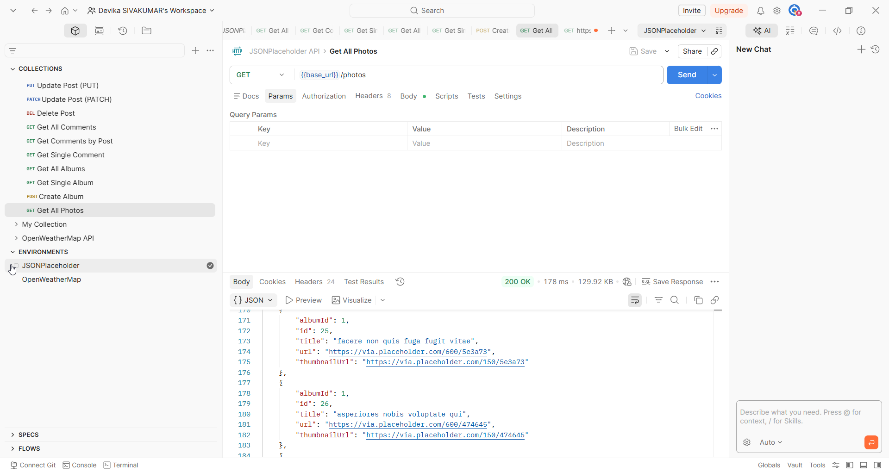
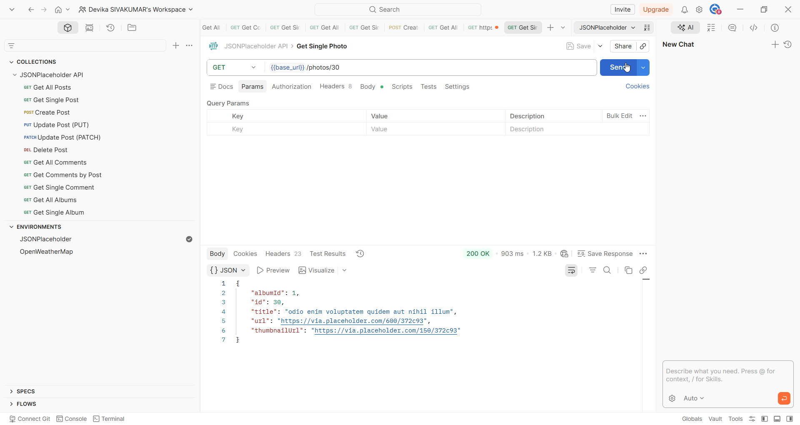
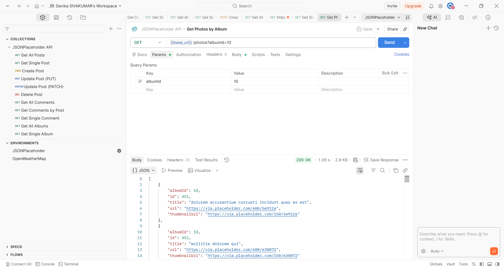

# Photos

## Overview

The Photos endpoint allows you to retrieve photos. Each photo belongs to an album and contains a title, a full-size image URL, and a thumbnail URL. Photos can be filtered by album ID.

## Base URL

```
https://jsonplaceholder.typicode.com
```

## Authentication

No authentication required. JSONPlaceholder is a free public API.

## Table of Contents

- [Get All Photos](#get-all-photos)
- [Get Single Photo](#get-single-photo)
- [Get Photos by Album](#get-photos-by-album)
- [Error Responses](#error-responses)

---

## Endpoints

| Method | Endpoint | Description |
|--------|----------|-------------|
| GET | /photos | Retrieve all photos |
| GET | /photos/{id} | Retrieve a single photo |
| GET | /photos?albumId={id} | Retrieve all photos for a specific album |

---

## Get All Photos

### Request

```
GET /photos
```

### Sample Request

```bash
curl https://jsonplaceholder.typicode.com/photos
```

### Sample Response

```json
[
  {
    "albumId": 1,
    "id": 1,
    "title": "accusamus beatae ad facilis cum similique qui sunt",
    "url": "https://via.placeholder.com/600/92c952",
    "thumbnailUrl": "https://via.placeholder.com/150/92c952"
  }
]
```



> **Note:** Returns an array of 5000 photos within 100 albums. Only one item is shown here for brevity.

### Response Fields

| Field | Type | Description |
|-------|------|-------------|
| albumId | number | ID of the album this photo belongs to |
| id | number | Unique identifier of the photo |
| title | string | Title of the photo |
| url | string | URL of the full-size image (600x600px) |
| thumbnailUrl | string | URL of the thumbnail image (150x150px) |

---

## Get Single Photo

### Request

```
GET /photos/{id}
```

### Path Parameters

| Parameter | Type | Required | Description |
|-----------|------|----------|-------------|
| id | number | Yes | The unique identifier of the photo |

### Sample Request

```bash
curl https://jsonplaceholder.typicode.com/photos/30
```

### Sample Response

```json
{
  "albumId": 1,
  "id": 30,
  "title": "odio enim voluptatem quidem aut nihil illum",
  "url": "https://via.placeholder.com/600/372c93",
  "thumbnailUrl": "https://via.placeholder.com/150/372c93"
}
```



---

## Get Photos by Album

### Request

```
GET /photos?albumId={id}
```

### Query Parameters

| Parameter | Type | Required | Description |
|-----------|------|----------|-------------|
| albumId | number | Yes | Filters photos by the ID of the parent album |

### Sample Request

```bash
curl https://jsonplaceholder.typicode.com/photos?albumId=1
```

### Sample Response

```json
[
  {
    "albumId": 1,
    "id": 1,
    "title": "accusamus beatae ad facilis cum similique qui sunt",
    "url": "https://via.placeholder.com/600/92c952",
    "thumbnailUrl": "https://via.placeholder.com/150/92c952"
  }
]
```



> **Note:** Returns all photos belonging to the specified album. Each album contains 50 photos.

---

## Error Responses

| Code | Description |
|------|-------------|
| 404 | Photo not found — the specified ID does not exist |
| 400 | Bad request — the request parameters are missing or malformed |