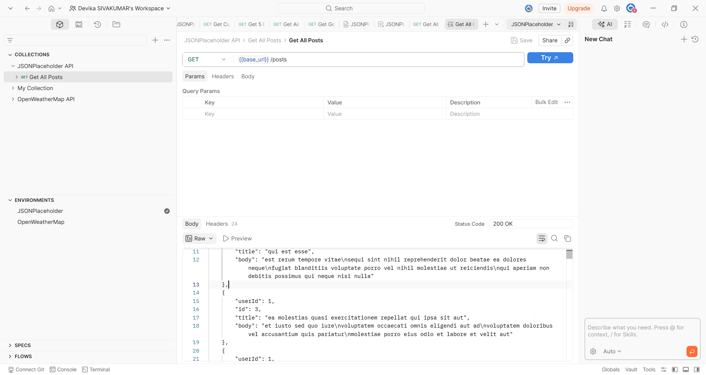
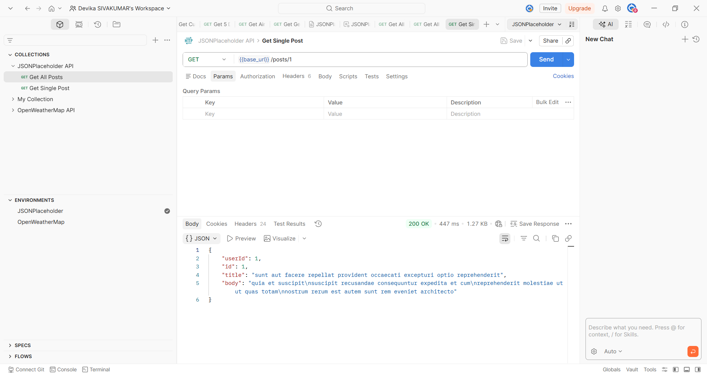
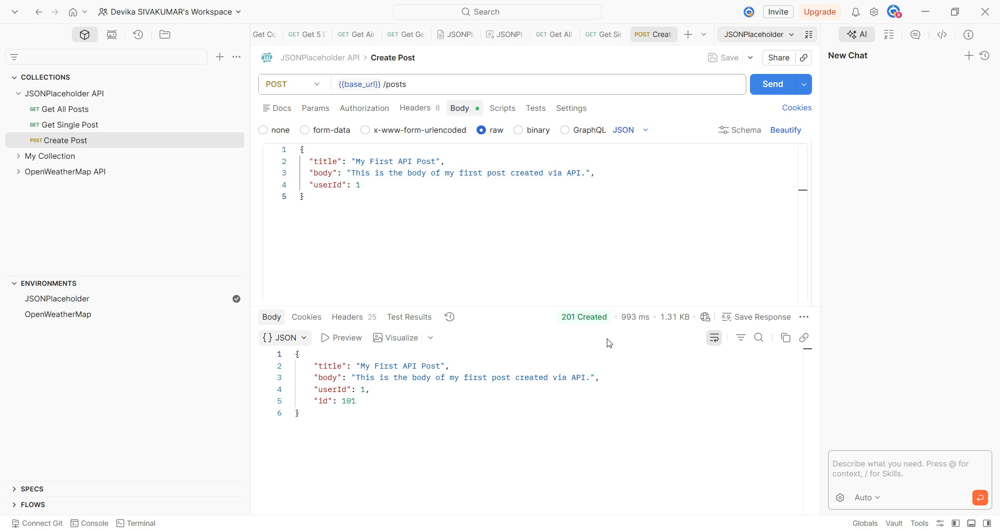
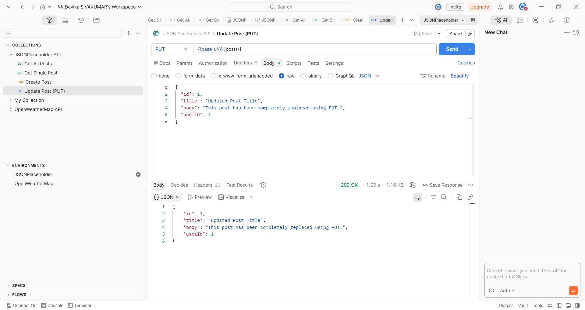
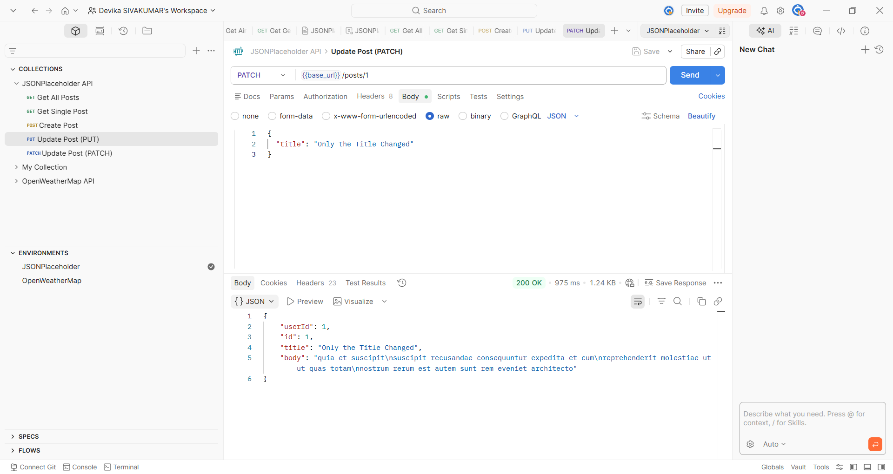
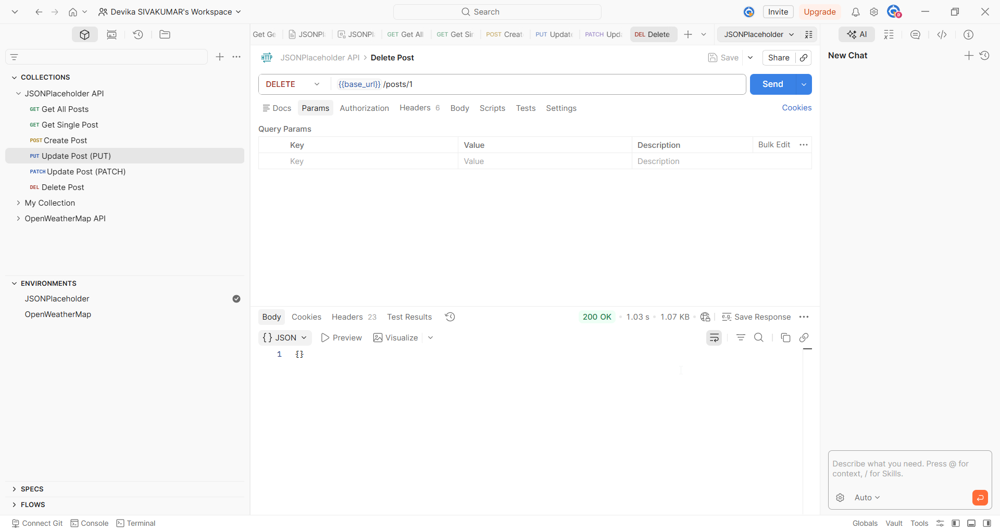

# Posts

## Overview

The Posts endpoint allows you to retrieve, create, update, and delete blog posts. Each post belongs to a user and contains a title and body.

## Base URL

```
https://jsonplaceholder.typicode.com
```

## Authentication

No authentication required. JSONPlaceholder is a free public API.

---

## Endpoints

| Method | Endpoint | Description |
|--------|----------|-------------|
| GET | /posts | Retrieve all posts |
| GET | /posts/{id} | Retrieve a single post |
| POST | /posts | Create a new post |
| PUT | /posts/{id} | Replace an existing post |
| PATCH | /posts/{id} | Update specific fields of a post |
| DELETE | /posts/{id} | Delete a post |

---

## Get All Posts

### Request

```
GET /posts
```

### Sample Request

```bash
curl https://jsonplaceholder.typicode.com/posts
```

### Sample Response

```json
[
  {
    "userId": 1,
    "id": 1,
    "title": "sunt aut facere repellat provident occaecati excepturi optio reprehenderit",
    "body": "quia et suscipit\nsuscipit recusandae consequuntur expedita et cum"
  }
]
```

> **Note:** Returns an array of 100 posts. Only one item is shown here for brevity.


### Response Fields

| Field | Type | Description |
|-------|------|-------------|
| userId | number | ID of the user who created the post |
| id | number | Unique identifier of the post |
| title | string | Title of the post |
| body | string | Main content of the post |

---

## Get Single Post

### Request

```
GET /posts/{id}
```

### Path Parameters

| Parameter | Type | Required | Description |
|-----------|------|----------|-------------|
| id | number | Yes | The unique identifier of the post |

### Sample Request

```bash
curl https://jsonplaceholder.typicode.com/posts/1
```

### Sample Response

```json
{
  "userId": 1,
  "id": 1,
  "title": "sunt aut facere repellat provident occaecati excepturi optio reprehenderit",
  "body": "quia et suscipit\nsuscipit recusandae consequuntur expedita et cum"
}
```


### Response Fields

| Field | Type | Description |
|-------|------|-------------|
| userId | number | ID of the user who created the post |
| id | number | Unique identifier of the post |
| title | string | Title of the post |
| body | string | Main content of the post |

---

## Create Post

### Request

```
POST /posts
```

### Request Body

| Field | Type | Required | Description |
|-------|------|----------|-------------|
| title | string | Yes | Title of the post |
| body | string | Yes | Main content of the post |
| userId | number | Yes | ID of the user creating the post |

### Sample Request

```bash
curl -X POST https://jsonplaceholder.typicode.com/posts \
  -H "Content-Type: application/json" \
  -d '{
    "title": "My First API Post",
    "body": "This is the body of my first post created via API.",
    "userId": 1
  }'
```

### Sample Response

```json
{
  "title": "My First API Post",
  "body": "This is the body of my first post created via API.",
  "userId": 1,
  "id": 101
}
```


### Response Fields

| Field | Type | Description |
|-------|------|-------------|
| title | string | Title of the created post |
| body | string | Main content of the created post |
| userId | number | ID of the user who created the post |
| id | number | Server-generated unique identifier for the new post |

---

## Update Post (PUT)

### Request

```
PUT /posts/{id}
```

### Path Parameters

| Parameter | Type | Required | Description |
|-----------|------|----------|-------------|
| id | number | Yes | The unique identifier of the post to replace |

### Request Body

| Field | Type | Required | Description |
|-------|------|----------|-------------|
| id | number | Yes | ID of the post |
| title | string | Yes | New title of the post |
| body | string | Yes | New body of the post |
| userId | number | Yes | ID of the user updating the post |

> **Important:** PUT replaces the entire post. Any fields not included in the request body will be removed or set to null.

### Sample Request

```bash
curl -X PUT https://jsonplaceholder.typicode.com/posts/1 \
  -H "Content-Type: application/json" \
  -d '{
    "id": 1,
    "title": "Updated Post Title",
    "body": "This post has been completely replaced using PUT.",
    "userId": 1
  }'
```

### Sample Response

```json
{
  "id": 1,
  "title": "Updated Post Title",
  "body": "This post has been completely replaced using PUT.",
  "userId": 1
}
```

---

## Update Post (PATCH)

### Request

```
PATCH /posts/{id}
```

### Path Parameters

| Parameter | Type | Required | Description |
|-----------|------|----------|-------------|
| id | number | Yes | The unique identifier of the post to update |

### Request Body

Send only the fields you want to update. All other fields remain unchanged.

| Field | Type | Required | Description |
|-------|------|----------|-------------|
| title | string | No | Updated title of the post |
| body | string | No | Updated body of the post |
| userId | number | No | Updated user ID |

### Sample Request

```bash
curl -X PATCH https://jsonplaceholder.typicode.com/posts/1 \
  -H "Content-Type: application/json" \
  -d '{
    "title": "Only the Title Changed"
  }'
```

### Sample Response

```json
{
  "userId": 1,
  "id": 1,
  "title": "Only the Title Changed",
  "body": "quia et suscipit\nsuscipit recusandae consequuntur expedita et cum"
}
```


---

## Delete Post

### Request

```
DELETE /posts/{id}
```

### Path Parameters

| Parameter | Type | Required | Description |
|-----------|------|----------|-------------|
| id | number | Yes | The unique identifier of the post to delete |

### Sample Request

```bash
curl -X DELETE https://jsonplaceholder.typicode.com/posts/1
```

### Sample Response

```json
{}
```

> **Note:** A successful DELETE request returns an empty object and a 200 OK status code.


---

## Error Responses

| Code | Description |
|------|-------------|
| 404 | Post not found — the specified ID does not exist |
| 400 | Bad request — the request body is missing or malformed |

---


