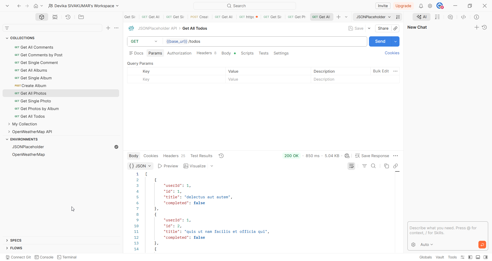
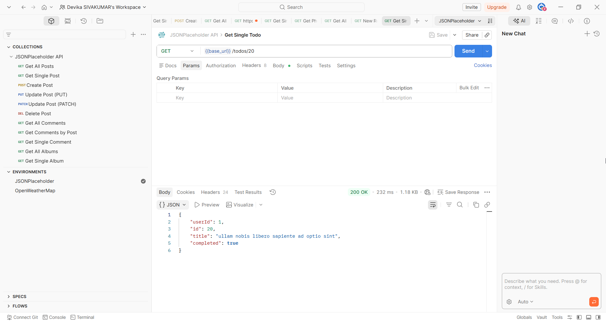

# Todos

## Overview

The Todos endpoint allows you to retrieve and update to-do items. Each todo belongs to a user and contains a title and a completion status.

## Base URL

```
https://jsonplaceholder.typicode.com
```

## Authentication

No authentication required. JSONPlaceholder is a free public API.

## Table of Contents

- [Get All Todos](#get-all-todos)
- [Get Single Todo](#get-single-todo)
- [Update Todo](#update-todo)
- [Error Responses](#error-responses)

---

## Endpoints

| Method | Endpoint | Description |
|--------|----------|-------------|
| GET | /todos | Retrieve all todos |
| GET | /todos/{id} | Retrieve a single todo |
| PATCH | /todos/{id} | Update the completion status of a todo |

---

## Get All Todos

### Request

```
GET /todos
```

### Sample Request

```bash
curl https://jsonplaceholder.typicode.com/todos
```

### Sample Response

```json
[
  {
    "userId": 1,
    "id": 1,
    "title": "delectus aut autem",
    "completed": false
  }
]
```



> **Note:** Returns an array of 200 todos. Only one item is shown here for brevity.

### Response Fields

| Field | Type | Description |
|-------|------|-------------|
| userId | number | ID of the user this todo belongs to |
| id | number | Unique identifier of the todo |
| title | string | Description of the todo item |
| completed | boolean | Completion status. `true` means completed, `false` means pending |

---

## Get Single Todo

### Request

```
GET /todos/{id}
```

### Path Parameters

| Parameter | Type | Required | Description |
|-----------|------|----------|-------------|
| id | number | Yes | The unique identifier of the todo |

### Sample Request

```bash
curl https://jsonplaceholder.typicode.com/todos/1
```

### Sample Response

```json
{
  "userId": 1,
  "id": 20,
  "title": "ullam nobis libero sapiente ad optio sint",
  "completed": true
}
```



---

## Update Todo

### Request

```
PATCH /todos/{id}
```

### Path Parameters

| Parameter | Type | Required | Description |
|-----------|------|----------|-------------|
| id | number | Yes | The unique identifier of the todo to update |

### Request Body

| Field | Type | Required | Description |
|-------|------|----------|-------------|
| completed | boolean | Yes | Set to `true` to mark the todo as complete, `false` to mark it as pending |

### Sample Request

```bash
curl -X PATCH https://jsonplaceholder.typicode.com/todos/1 \
  -H "Content-Type: application/json" \
  -d '{
    "completed": true
  }'
```

### Sample Response

```json
{
  "userId": 1,
  "id": 1,
  "title": "delectus aut autem",
  "completed": true
}
```


> **Note:** Only the `completed` field is updated. All other fields remain unchanged.

---

## Error Responses

| Code | Description |
|------|-------------|
| 404 | Todo not found — the specified ID does not exist |
| 400 | Bad request — the request body is missing or malformed |