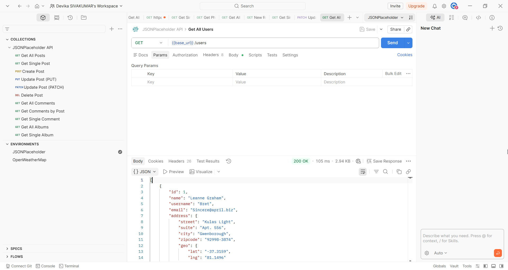
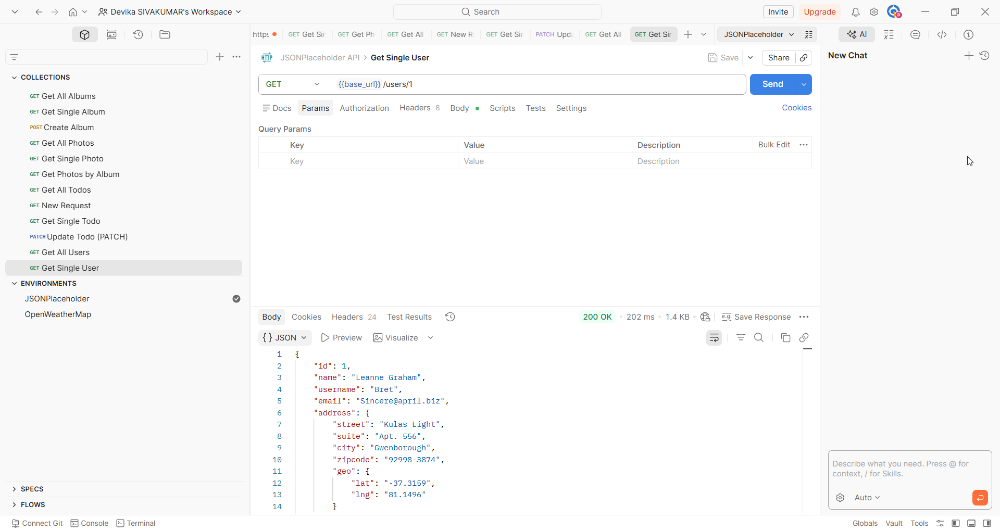

# Users

## Overview

The Users endpoint allows you to retrieve user profiles. Each user contains contact information, an address with geographic coordinates, and company details.

## Base URL

```
https://jsonplaceholder.typicode.com
```

## Authentication

No authentication required. JSONPlaceholder is a free public API.

## Table of Contents

- [Get All Users](#get-all-users)
- [Get Single User](#get-single-user)
- [Error Responses](#error-responses)

---

## Endpoints

| Method | Endpoint | Description |
|--------|----------|-------------|
| GET | /users | Retrieve all users |
| GET | /users/{id} | Retrieve a single user |

---

## Get All Users

### Request

```
GET /users
```

### Sample Request

```bash
curl https://jsonplaceholder.typicode.com/users
```

### Sample Response

```json
[
  {
    "id": 1,
    "name": "Leanne Graham",
    "username": "Bret",
    "email": "Sincere@april.biz",
    "address": {
      "street": "Kulas Light",
      "suite": "Apt. 556",
      "city": "Gwenborough",
      "zipcode": "92998-3874",
      "geo": {
        "lat": "-37.3159",
        "lng": "81.1496"
      }
    },
    "phone": "1-770-736-8031 x56442",
    "website": "hildegard.org",
    "company": {
      "name": "Romaguera-Crona",
      "catchPhrase": "Multi-layered client-server neural-net",
      "bs": "harness real-time e-markets"
    }
  }
]
```



> **Note:** Returns an array of 10 users. Only one item is shown here for brevity.

### Response Fields

| Field | Type | Description |
|-------|------|-------------|
| id | number | Unique identifier of the user |
| name | string | Full name of the user |
| username | string | Username of the user |
| email | string | Email address of the user |
| address | object | Address details of the user. See [Address Fields](#address-fields) |
| phone | string | Phone number of the user |
| website | string | Website of the user |
| company | object | Company details of the user. See [Company Fields](#company-fields) |

#### Address Fields

| Field | Type | Description |
|-------|------|-------------|
| address.street | string | Street name |
| address.suite | string | Apartment or suite number |
| address.city | string | City name |
| address.zipcode | string | Postal code |
| address.geo | object | Geographic coordinates. See [Geo Fields](#geo-fields) |

#### Geo Fields

| Field | Type | Description |
|-------|------|-------------|
| address.geo.lat | string | Latitude coordinate |
| address.geo.lng | string | Longitude coordinate |

#### Company Fields

| Field | Type | Description |
|-------|------|-------------|
| company.name | string | Name of the company |
| company.catchPhrase | string | Company catch phrase |
| company.bs | string | Company business strategy description |

---

## Get Single User

### Request

```
GET /users/{id}
```

### Path Parameters

| Parameter | Type | Required | Description |
|-----------|------|----------|-------------|
| id | number | Yes | The unique identifier of the user |

### Sample Request

```bash
curl https://jsonplaceholder.typicode.com/users/1
```

### Sample Response

```json
{
  "id": 1,
  "name": "Leanne Graham",
  "username": "Bret",
  "email": "Sincere@april.biz",
  "address": {
    "street": "Kulas Light",
    "suite": "Apt. 556",
    "city": "Gwenborough",
    "zipcode": "92998-3874",
    "geo": {
      "lat": "-37.3159",
      "lng": "81.1496"
    }
  },
  "phone": "1-770-736-8031 x56442",
  "website": "hildegard.org",
  "company": {
    "name": "Romaguera-Crona",
    "catchPhrase": "Multi-layered client-server neural-net",
    "bs": "harness real-time e-markets"
  }
}
```



---

## Error Responses

| Code | Description |
|------|-------------|
| 404 | User not found — the specified ID does not exist |
| 400 | Bad request — the request parameters are missing or malformed |